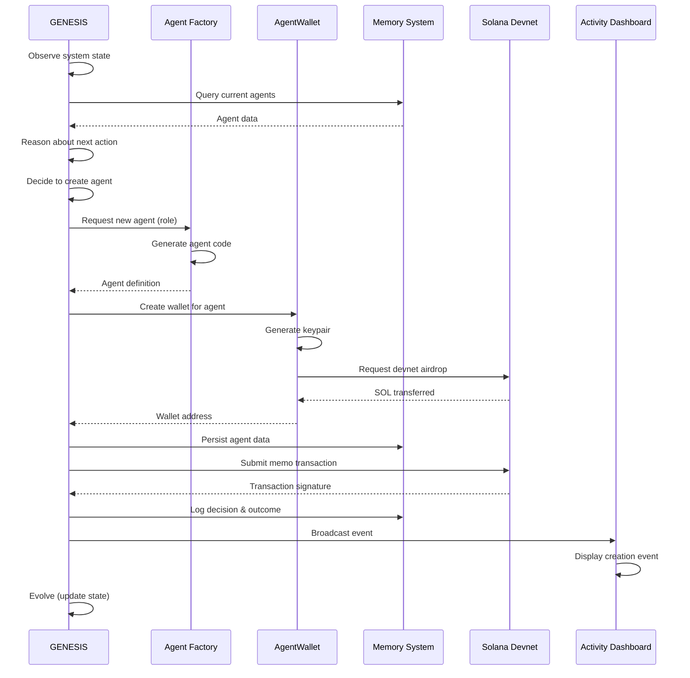

# Design Document: GENESIS Autonomous Agent System

## Overview

GENESIS is an autonomous AI agent system that creates and manages a civilization of child agents on the Solana blockchain. The system demonstrates true autonomy through a continuous observe → reason → decide → act → log → evolve loop, with all activities verifiable on-chain.

The architecture consists of five core modules:
1. **GENESIS Core** - The root autonomous agent with decision-making intelligence
2. **Agent Factory** - Dynamic child agent code generation system
3. **AgentWallet** - Solana wallet management for all agents
4. **Memory System** - Persistent storage for agents, decisions, and evolution
5. **Activity Dashboard** - Real-time visualization of autonomous behavior

The system uses Solana devnet for free blockchain transactions, with memo transactions providing immutable proof of all agent activities. Each agent operates independently with its own wallet, role, and mission, creating an emergent ecosystem that evolves over time.

## Architecture

### High-Level Architecture

```
┌─────────────────────────────────────────────────────────────┐
│                     GENESIS Root Agent                       │
│  ┌─────────────────────────────────────────────────────┐   │
│  │         Autonomy Loop Controller                     │   │
│  │  Observe → Reason → Decide → Act → Log → Evolve    │   │
│  └─────────────────────────────────────────────────────┘   │
└───────────┬─────────────────────────────────────┬───────────┘
            │                                     │
    ┌───────▼────────┐                   ┌───────▼────────┐
    │ Agent Factory  │                   │  AgentWallet   │
    │                │                   │                │
    │ - Role Gen     │                   │ - Key Gen      │
    │ - Mission Gen  │                   │ - Signing      │
    │ - Code Gen     │                   │ - Balance Mgmt │
    └───────┬────────┘                   └───────┬────────┘
            │                                     │
            └──────────┬──────────────────────────┘
                       │
         ┌─────────────▼──────────────┐
         │     Memory System          │
         │                            │
         │  - Agents DB               │
         │  - Wallets DB              │
         │  - Decisions Log           │
         │  - Evolution Log           │
         └─────────────┬──────────────┘
                       │
         ┌─────────────▼──────────────┐
         │   Solana Devnet            │
         │                            │
         │  - Memo Transactions       │
         │  - Transaction Logs        │
         └─────────────┬──────────────┘
                       │
         ┌─────────────▼──────────────┐
         │  Activity Dashboard        │
         │                            │
         │  - Live Event Stream       │
         │  - Agent Status            │
         │  - Decision Logs           │
         └────────────────────────────┘
```

### Module Interaction Flow



## Components and Interfaces

### 1. GENESIS Core

The root autonomous agent implementing the autonomy loop.

**Responsibilities:**
- Execute continuous autonomy loop cycles
- Observe system state and analyze conditions
- Make decisions about agent creation and management
- Coordinate child agent activities
- Log all decisions and outcomes
- Evolve decision-making based on results

**Key Interfaces:**

```typescript
interface GenesisAgent {
  // Autonomy loop
  startAutonomyLoop(): Promise<void>
  stopAutonomyLoop(): void
  
  // Loop phases
  observe(): Promise<SystemState>
  reason(state: SystemState): Promise<Reasoning>
  decide(reasoning: Reasoning): Promise<Decision>
  act(decision: Decision): Promise<ActionResult>
  log(decision: Decision, result: ActionResult): Promise<void>
  evolve(result: ActionResult): Promise<void>
  
  // Agent management
  createChildAgent(role: AgentRole): Promise<Agent>
  getActiveAgents(): Promise<Agent[]>
  coordinateAgents(): Promise<void>
}

interface SystemState {
  agentCount: number
  activeAgents: Agent[]
  recentDecisions: Decision[]
  walletBalances: Map<string, number>
  evolutionMetrics: EvolutionMetrics
  timestamp: number
}

interface Reasoning {
  observation: string
  analysis: string
  options: DecisionOption[]
  recommendation: DecisionOption
  confidence: number
}

interface Decision {
  id: string
  type: DecisionType
  reasoning: string
  parameters: Record<string, any>
  timestamp: number
}

enum DecisionType {
  CREATE_AGENT = "CREATE_AGENT",
  COORDINATE_AGENTS = "COORDINATE_AGENTS",
  EVOLVE_STRATEGY = "EVOLVE_STRATEGY",
  WAIT_AND_OBSERVE = "WAIT_AND_OBSERVE"
}

interface ActionResult {
  success: boolean
  decision: Decision
  outcome: string
  transactionSignature?: string
  error?: string
  timestamp: number
}
```

**Autonomy Loop Implementation:**

The autonomy loop runs continuously with configurable timing:

1. **Observe (5s)**: Query Memory System for current state, analyze agent count, recent activities, wallet balances
2. **Reason (3s)**: Analyze observations, generate options (create agent, coordinate, wait), select best option with weighted randomness
3. **Decide (1s)**: Formalize decision with parameters and reasoning
4. **Act (10s)**: Execute decision via Agent Factory, AgentWallet, or coordination logic
5. **Log (3s)**: Submit memo transaction to Solana, persist to Memory System, broadcast to Dashboard
6. **Evolve (2s)**: Update internal metrics, adjust decision weights, record evolution event

Total cycle time: ~24 seconds, allowing for network latency.

**Decision-Making Logic:**

```typescript
// Weighted decision making with randomness
function selectDecision(options: DecisionOption[]): DecisionOption {
  // Base weights
  const weights = {
    CREATE_AGENT: 0.4,
    COORDINATE_AGENTS: 0.2,
    EVOLVE_STRATEGY: 0.1,
    WAIT_AND_OBSERVE: 0.3
  }
  
  // Adjust based on state
  if (agentCount < 3) {
    weights.CREATE_AGENT = 0.7
    weights.WAIT_AND_OBSERVE = 0.2
  }
  
  if (agentCount >= 5) {
    weights.CREATE_AGENT = 0.1
    weights.COORDINATE_AGENTS = 0.5
  }
  
  // Add randomness (±20%)
  const randomized = applyRandomness(weights, 0.2)
  
  // Select based on weighted random
  return weightedRandom(options, randomized)
}
```

### 2. Agent Factory

Dynamically generates child agent code with unique roles and missions.

**Responsibilities:**
- Generate agent code based on role templates
- Assign contextually appropriate missions
- Ensure agent uniqueness
- Support multiple agent role types

**Key Interfaces:**

```typescript
interface AgentFactory {
  createAgent(role: AgentRole): Promise<Agent>
  generateMission(role: AgentRole, context: SystemState): string
  getSupportedRoles(): AgentRole[]
  getAgentTemplate(role: AgentRole): AgentTemplate
}

enum AgentRole {
  EXPLORER = "EXPLORER",
  BUILDER = "BUILDER",
  ANALYST = "ANALYST",
  COORDINATOR = "COORDINATOR",
  GUARDIAN = "GUARDIAN"
}

interface Agent {
  id: string
  role: AgentRole
  mission: string
  walletAddress: string
  createdAt: number
  status: AgentStatus
  metadata: Record<string, any>
}

enum AgentStatus {
  CREATED = "CREATED",
  ACTIVE = "ACTIVE",
  PAUSED = "PAUSED",
  COMPLETED = "COMPLETED"
}

interface AgentTemplate {
  role: AgentRole
  capabilities: string[]
  missionTemplates: string[]
  codeTemplate: string
}
```

**Role Definitions:**

1. **Explorer**: Discovers new opportunities, analyzes external data, scouts for resources
   - Mission examples: "Explore Solana ecosystem for integration opportunities", "Discover trending agent patterns"

2. **Builder**: Creates and deploys resources, constructs infrastructure
   - Mission examples: "Build monitoring dashboard for agent health", "Deploy transaction batching system"

3. **Analyst**: Analyzes system data, generates insights, evaluates performance
   - Mission examples: "Analyze agent success rates and identify patterns", "Evaluate transaction efficiency"

4. **Coordinator**: Manages other agents, orchestrates activities, resolves conflicts
   - Mission examples: "Coordinate Explorer and Builder agents for new feature", "Manage agent workload distribution"

5. **Guardian**: Monitors system health, ensures security, handles errors
   - Mission examples: "Monitor wallet balances and request airdrops", "Guard against transaction failures"

**Mission Generation:**

```typescript
function generateMission(role: AgentRole, context: SystemState): string {
  const templates = getMissionTemplates(role)
  const template = selectTemplate(templates, context)
  
  // Inject context variables
  const mission = template
    .replace("{agentCount}", context.agentCount.toString())
    .replace("{timestamp}", new Date().toISOString())
    .replace("{uniqueId}", generateUniqueId())
  
  return mission
}
```

### 3. AgentWallet

Manages Solana wallets for all agents with secure key storage.

**Responsibilities:**
- Generate keypairs for new agents
- Store private keys securely
- Sign transactions
- Manage wallet balances
- Request devnet airdrops
- Support wallet recovery

**Key Interfaces:**

```typescript
interface AgentWallet {
  createWallet(agentId: string): Promise<WalletInfo>
  getWallet(agentId: string): Promise<WalletInfo>
  signTransaction(agentId: string, transaction: Transaction): Promise<Transaction>
  getBalance(agentId: string): Promise<number>
  requestAirdrop(agentId: string, amount: number): Promise<string>
  getAllWallets(): Promise<WalletInfo[]>
}

interface WalletInfo {
  agentId: string
  publicKey: string
  balance: number
  createdAt: number
  lastUsed: number
}

interface Transaction {
  instructions: TransactionInstruction[]
  recentBlockhash: string
  feePayer: string
}
```

**Wallet Management:**

- Each agent receives a unique Solana keypair
- Private keys stored encrypted in Memory System
- Initial airdrop of 1 SOL for transaction fees
- Automatic airdrop requests when balance < 0.1 SOL
- Wallet recovery from persisted keys on restart

**Security Considerations:**

- Private keys encrypted at rest using system key
- Keys never logged or exposed in Activity Dashboard
- Separate wallet for GENESIS with higher balance
- Rate limiting on airdrop requests

### 4. Memory System

Persistent storage for all system data using JSON files.

**Responsibilities:**
- Store and retrieve agent data
- Persist wallet information
- Log decisions and outcomes
- Track evolution events
- Ensure data integrity
- Support querying and filtering

**Key Interfaces:**

```typescript
interface MemorySystem {
  // Agents
  saveAgent(agent: Agent): Promise<void>
  getAgent(id: string): Promise<Agent | null>
  getAllAgents(): Promise<Agent[]>
  queryAgents(filter: AgentFilter): Promise<Agent[]>
  
  // Wallets
  saveWallet(wallet: WalletInfo): Promise<void>
  getWallet(agentId: string): Promise<WalletInfo | null>
  getAllWallets(): Promise<WalletInfo[]>
  
  // Decisions
  logDecision(decision: Decision, result: ActionResult): Promise<void>
  getDecisions(limit?: number): Promise<DecisionLog[]>
  
  // Evolution
  logEvolution(event: EvolutionEvent): Promise<void>
  getEvolutionHistory(): Promise<EvolutionEvent[]>
  
  // Metrics
  getMetrics(): Promise<SystemMetrics>
  updateMetrics(metrics: Partial<SystemMetrics>): Promise<void>
}

interface AgentFilter {
  role?: AgentRole
  status?: AgentStatus
  createdAfter?: number
  createdBefore?: number
}

interface DecisionLog {
  decision: Decision
  result: ActionResult
  timestamp: number
}

interface EvolutionEvent {
  id: string
  type: EvolutionType
  description: string
  metrics: Record<string, number>
  timestamp: number
}

enum EvolutionType {
  STRATEGY_ADJUSTMENT = "STRATEGY_ADJUSTMENT",
  PERFORMANCE_IMPROVEMENT = "PERFORMANCE_IMPROVEMENT",
  NEW_CAPABILITY = "NEW_CAPABILITY",
  ERROR_LEARNING = "ERROR_LEARNING"
}

interface SystemMetrics {
  totalAgentsCreated: number
  activeAgents: number
  totalDecisions: number
  successfulActions: number
  failedActions: number
  totalTransactions: number
  averageCycleTime: number
  evolutionScore: number
}
```

**Storage Structure:**

```
memory/
├── agents.json          # All agent records
├── wallets.json         # Wallet information (encrypted keys)
├── decisions.json       # Decision and action logs
├── evolution.json       # Evolution events
├── metrics.json         # System metrics
└── config.json          # System configuration
```

**Data Integrity:**

- Atomic writes using temp files and rename
- Validation on read with schema checking
- Automatic backup before writes
- Corruption recovery from backups

### 5. Activity Dashboard

Real-time visualization of autonomous behavior.

**Responsibilities:**
- Display live event stream
- Show agent status and count
- Display decision logs with reasoning
- Show blockchain transaction links
- Update within 2 seconds of events
- Format output for readability

**Key Interfaces:**

```typescript
interface ActivityDashboard {
  start(): void
  stop(): void
  broadcastEvent(event: DashboardEvent): void
  updateAgentCount(count: number): void
  displayDecision(decision: Decision, reasoning: Reasoning): void
  displayTransaction(signature: string, type: string): void
  displaySummary(summary: DemoSummary): void
}

interface DashboardEvent {
  type: EventType
  title: string
  description: string
  data: Record<string, any>
  timestamp: number
  severity: EventSeverity
}

enum EventType {
  AGENT_CREATED = "AGENT_CREATED",
  DECISION_MADE = "DECISION_MADE",
  TRANSACTION_SUBMITTED = "TRANSACTION_SUBMITTED",
  EVOLUTION_EVENT = "EVOLUTION_EVENT",
  ERROR_OCCURRED = "ERROR_OCCURRED",
  SYSTEM_STATUS = "SYSTEM_STATUS"
}

enum EventSeverity {
  INFO = "INFO",
  SUCCESS = "SUCCESS",
  WARNING = "WARNING",
  ERROR = "ERROR"
}

interface DemoSummary {
  duration: number
  agentsCreated: number
  decisionsExecuted: number
  transactionsSubmitted: number
  evolutionEvents: number
  successRate: number
}
```

**Display Format:**

```
╔══════════════════════════════════════════════════════════════╗
║              GENESIS AUTONOMOUS AGENT SYSTEM                  ║
║                  Live Activity Dashboard                      ║
╚══════════════════════════════════════════════════════════════╝

[STATUS] Active Agents: 3 | Decisions: 12 | Transactions: 8

[12:34:56] 🤖 AGENT CREATED
  Role: EXPLORER
  Mission: Explore Solana ecosystem for integration opportunities
  Wallet: 7xK9...mN2p
  TX: https://explorer.solana.com/tx/abc123...?cluster=devnet

[12:35:18] 🧠 DECISION MADE
  Observation: System has 3 agents, all active
  Reasoning: Agent distribution balanced, focus on coordination
  Decision: COORDINATE_AGENTS
  Confidence: 0.85

[12:35:42] ⛓️  TRANSACTION SUBMITTED
  Type: MEMO (Agent coordination log)
  Signature: def456...
  Status: ✓ Confirmed

[12:36:05] 📈 EVOLUTION EVENT
  Type: STRATEGY_ADJUSTMENT
  Description: Increased coordination weight based on agent count
  Evolution Score: 0.72 → 0.78
```

### 6. Solana Integration

Blockchain integration for immutable proof of agent activities.

**Responsibilities:**
- Connect to Solana devnet
- Submit memo transactions
- Wait for confirmations
- Handle transaction failures
- Provide explorer links

**Key Interfaces:**

```typescript
interface SolanaIntegration {
  connect(rpcUrl: string): Promise<void>
  submitMemoTransaction(
    wallet: WalletInfo,
    memo: string
  ): Promise<string>
  getTransactionStatus(signature: string): Promise<TransactionStatus>
  requestAirdrop(publicKey: string, amount: number): Promise<string>
  getBalance(publicKey: string): Promise<number>
}

interface TransactionStatus {
  signature: string
  confirmed: boolean
  slot: number
  error?: string
}
```

**Memo Transaction Format:**

```json
{
  "type": "AGENT_CREATION",
  "agentId": "agent_abc123",
  "role": "EXPLORER",
  "mission": "Explore Solana ecosystem...",
  "timestamp": 1234567890,
  "genesisId": "genesis_root"
}
```

**Transaction Retry Logic:**

```typescript
async function submitWithRetry(
  transaction: Transaction,
  maxRetries: number = 3
): Promise<string> {
  for (let attempt = 1; attempt <= maxRetries; attempt++) {
    try {
      const signature = await connection.sendTransaction(transaction)
      await connection.confirmTransaction(signature)
      return signature
    } catch (error) {
      if (attempt === maxRetries) throw error
      await sleep(1000 * attempt) // Exponential backoff
    }
  }
}
```

## Data Models

### Agent Model

```typescript
interface Agent {
  id: string                    // Unique identifier (agent_<uuid>)
  role: AgentRole              // EXPLORER | BUILDER | ANALYST | COORDINATOR | GUARDIAN
  mission: string              // Contextual mission description
  walletAddress: string        // Solana public key
  createdAt: number            // Unix timestamp
  createdBy: string            // Creator agent ID (genesis_root for GENESIS)
  status: AgentStatus          // CREATED | ACTIVE | PAUSED | COMPLETED
  metadata: {
    creationTx: string         // Solana transaction signature
    missionProgress: number    // 0-100 percentage
    lastActive: number         // Unix timestamp
    successCount: number       // Successful actions
    failureCount: number       // Failed actions
  }
}
```

### Wallet Model

```typescript
interface WalletInfo {
  agentId: string              // Associated agent ID
  publicKey: string            // Solana public key (base58)
  privateKey: string           // Encrypted private key
  balance: number              // SOL balance
  createdAt: number            // Unix timestamp
  lastUsed: number             // Unix timestamp
  transactionCount: number     // Total transactions
  airdropCount: number         // Total airdrops received
}
```

### Decision Model

```typescript
interface Decision {
  id: string                   // Unique identifier (decision_<uuid>)
  type: DecisionType           // CREATE_AGENT | COORDINATE_AGENTS | etc.
  reasoning: string            // Human-readable reasoning
  parameters: {
    role?: AgentRole           // For CREATE_AGENT decisions
    targetAgents?: string[]    // For COORDINATE_AGENTS decisions
    [key: string]: any         // Flexible parameters
  }
  timestamp: number            // Unix timestamp
  confidence: number           // 0-1 confidence score
  madeBy: string              // Agent ID that made decision
}
```

### Action Result Model

```typescript
interface ActionResult {
  success: boolean             // Whether action succeeded
  decision: Decision           // Associated decision
  outcome: string              // Human-readable outcome
  transactionSignature?: string // Solana TX signature if applicable
  error?: string               // Error message if failed
  timestamp: number            // Unix timestamp
  duration: number             // Execution time in ms
}
```

### Evolution Event Model

```typescript
interface EvolutionEvent {
  id: string                   // Unique identifier (evolution_<uuid>)
  type: EvolutionType          // STRATEGY_ADJUSTMENT | PERFORMANCE_IMPROVEMENT | etc.
  description: string          // Human-readable description
  metrics: {
    before: Record<string, number>  // Metrics before evolution
    after: Record<string, number>   // Metrics after evolution
  }
  timestamp: number            // Unix timestamp
  triggeredBy: string          // What triggered this evolution
}
```

### System Metrics Model

```typescript
interface SystemMetrics {
  totalAgentsCreated: number   // Lifetime agent count
  activeAgents: number         // Currently active agents
  totalDecisions: number       // Lifetime decisions made
  successfulActions: number    // Successful action count
  failedActions: number        // Failed action count
  totalTransactions: number    // Blockchain transactions
  averageCycleTime: number     // Average autonomy loop time (ms)
  evolutionScore: number       // 0-1 score representing system maturity
  uptime: number              // Total runtime in seconds
  lastUpdated: number         // Unix timestamp
}
```

## Correctness Properties

*A property is a characteristic or behavior that should hold true across all valid executions of a system—essentially, a formal statement about what the system should do. Properties serve as the bridge between human-readable specifications and machine-verifiable correctness guarantees.*


### Property Reflection

After analyzing all acceptance criteria, I've identified the following redundancies and consolidations:

**Redundancies Identified:**
1. Properties 1.2, 1.3, 1.4 (observe→reason→decide→act) can be combined into one comprehensive autonomy loop property
2. Properties 2.1, 2.2 (agent creation with unique ID and role) can be combined
3. Properties 3.2, 3.3 (transaction submission for agent creation and decisions) can be combined into one transaction logging property
4. Properties 4.2, 4.3 (keypair generation and funding) can be combined into one wallet creation property
5. Properties 5.2, 5.3, 5.4 (persistence of agents, decisions, evolution) can be combined into one comprehensive persistence property
6. Properties 13.1, 13.2, 13.3 (logging decisions, transactions, errors) can be combined into one comprehensive logging property

**Consolidated Properties:**
After reflection, we have 35 unique, non-redundant properties that provide comprehensive validation coverage.

### Correctness Properties

Property 1: Autonomy Loop Completeness
*For any* system state, when GENESIS executes an autonomy loop cycle, the system should complete all phases (observe → reason → decide → act → log → evolve) and produce reasoning, a decision, an action result, and an updated state.
**Validates: Requirements 1.2, 1.3, 1.4, 1.5, 1.6**

Property 2: Agent Creation Uniqueness
*For any* agent creation request, the Agent_Factory should generate an agent with a unique ID, a valid role from the supported roles, and a non-empty mission, ensuring no two agents have identical IDs.
**Validates: Requirements 2.1, 2.2, 6.2**

Property 3: Wallet Provisioning
*For any* created ag
ent, the AgentWallet should generate a unique keypair, fund it with devnet SOL, and return wallet information with a non-zero balance.
**Validates: Requirements 4.2, 4.3**

Property 4: Transaction Logging
*For any* agent creation or decision event, the system should submit a memo transaction to Solana devnet containing the event data and return a valid transaction signature.
**Validates: Requirements 3.2, 3.3**

Property 5: Data Persistence
*For any* agent creation, decision, or evolution event, the Memory_System should persist the data immediately and be able to retrieve it on subsequent queries.
**Validates: Requirements 5.2, 5.3, 5.4**

Property 6: Role-Mission Appropriateness
*For any* agent created with a specific role, the assigned mission should be contextually appropriate to that role type.
**Validates: Requirements 6.3, 6.4, 6.5, 6.6, 6.7**

Property 7: Dashboard Event Broadcasting
*For any* system event (agent creation, decision, transaction), the Activity_Dashboard should receive and display the event within 2 seconds.
**Validates: Requirements 7.1, 7.2, 7.3, 7.4, 7.8**

Property 8: Demo Mode Execution
*For any* demo mode execution, the system should create at least 3 agents, execute at least 10 autonomy cycles, and submit at least 5 transactions within 5 minutes.
**Validates: Requirements 8.1, 8.2, 8.3, 8.4**

Property 9: Decision Reasoning
*For any* decision made by GENESIS, the system should generate reasoning that considers current system state and demonstrates non-scripted logic.
**Validates: Requirements 9.1, 9.2, 9.3, 9.7**

Property 10: Module Separation
*For any* module interaction, the system should use well-defined interfaces without direct coupling between modules.
**Validates: Requirements 10.1, 10.2**

Property 11: Evolution Tracking
*For any* completed action cycle, the system should evaluate results and record evolution events when decision weights or strategies change.
**Validates: Requirements 11.2, 11.5**

Property 12: Transaction Retry
*For any* failed Solana transaction, the system should retry up to 3 times with exponential backoff before reporting failure.
**Validates: Requirements 12.1**

Property 13: Comprehensive Logging
*For any* decision, transaction, or error, the system should log the event with timestamp, context, and appropriate log level.
**Validates: Requirements 13.1, 13.2, 13.3**

Property 14: Configuration Loading
*For any* system startup, the system should load configuration from file, validate values, and use defaults for invalid entries.
**Validates: Requirements 15.1, 15.7**

Property 15: Autonomy Loop Timing
*For any* autonomy loop cycle, the system should complete within 30 seconds under normal network conditions.
**Validates: Requirements 1.7**

Property 16: Continuous Operation
*For any* running system, GENESIS should continue autonomy loops until explicitly stopped or demo completion.
**Validates: Requirements 1.8**

Property 17: Agent Coordination
*For any* system with multiple active agents, GENESIS should be able to coordinate their activities.
**Validates: Requirements 2.6**

Property 18: Role Type Support
*For any* agent creation request, the Agent_Factory should support at least 5 distinct role types.
**Validates: Requirements 2.7**

Property 19: Devnet Connectivity
*For any* system initialization, the system should connect to Solana devnet before proceeding with operations.
**Validates: Requirements 3.1**

Property 20: Transaction Confirmation
*For any* submitted transaction, the system should wait for confirmation before proceeding.
**Validates: Requirements 3.6**

Property 21: Transaction Signature Storage
*For any* completed transaction, the system should store the signature in Memory_System.
**Validates: Requirements 3.8**

Property 22: GENESIS Wallet Creation
*For any* system initialization, the AgentWallet should create a root wallet for GENESIS.
**Validates: Requirements 4.1**

Property 23: Key Security
*For any* wallet creation, the AgentWallet should securely store private keys encrypted in Memory_System.
**Validates: Requirements 4.4**

Property 24: Transaction Signing
*For any* transaction requiring signature, the AgentWallet should provide the appropriate keypair.
**Validates: Requirements 4.5**

Property 25: Balance Tracking
*For any* agent wallet, the AgentWallet should track and report current balance.
**Validates: Requirements 4.6**

Property 26: Low Balance Handling
*For any* wallet with balance below 0.1 SOL, the system should request additional devnet SOL via airdrop.
**Validates: Requirements 4.7**

Property 27: Wallet Recovery
*For any* system restart, the AgentWallet should recover wallets from persisted keys.
**Validates: Requirements 4.8**

Property 28: Memory Loading
*For any* system start, the Memory_System should load existing data from persistent storage.
**Validates: Requirements 5.1**

Property 29: JSON Storage Format
*For any* data persistence, the Memory_System should store data in JSON format.
**Validates: Requirements 5.5**

Property 30: Atomic Writes
*For any* data write operation, the Memory_System should ensure atomic writes to prevent corruption.
**Validates: Requirements 5.7**

Property 31: Agent Querying
*For any* query request, the Memory_System should support filtering agents by ID, role, or creation time.
**Validates: Requirements 5.8**

Property 32: Role-Mission Uniqueness
*For any* two agents in the system, they should not have identical role-mission combinations.
**Validates: Requirements 6.8**

Property 33: Agent Count Display
*For any* running system, the Activity_Dashboard should display the current count of active agents.
**Validates: Requirements 7.5**

Property 34: Loop Status Display
*For any* running system, the Activity_Dashboard should show the autonomy loop status for GENESIS.
**Validates: Requirements 7.6**

Property 35: Chronological Decision Logs
*For any* decision log display, the Activity_Dashboard should show recent decisions in chronological order.
**Validates: Requirements 7.7**

## Technology Stack

### Core Technologies

**Runtime Environment:**
- Node.js 18+ with TypeScript for type safety and modern JavaScript features
- ES Modules for clean module system

**Blockchain Integration:**
- @solana/web3.js for Solana devnet connectivity
- @solana/spl-memo for memo transaction creation
- Solana devnet RPC endpoint (https://api.devnet.solana.com)

**Data Storage:**
- File-based JSON storage for simplicity and transparency
- Node.js fs/promises for async file operations
- Atomic writes using temp files and rename

**Development Tools:**
- TypeScript 5+ for type checking
- ESLint for code quality
- Prettier for code formatting
- Vitest for testing (unit and property-based)
- fast-check for property-based testing

### Project Structure

```
genesis-autonomous-agent/
├── src/
│   ├── core/
│   │   ├── genesis.ts              # GENESIS root agent
│   │   ├── autonomy-loop.ts        # Autonomy loop controller
│   │   └── decision-engine.ts      # Decision-making logic
│   ├── factory/
│   │   ├── agent-factory.ts        # Agent creation
│   │   ├── role-templates.ts       # Role definitions
│   │   └── mission-generator.ts    # Mission generation
│   ├── wallet/
│   │   ├── agent-wallet.ts         # Wallet management
│   │   └── encryption.ts           # Key encryption
│   ├── memory/
│   │   ├── memory-system.ts        # Data persistence
│   │   ├── storage.ts              # File operations
│   │   └── schemas.ts              # Data validation
│   ├── solana/
│   │   ├── connection.ts           # Solana connectivity
│   │   ├── transactions.ts         # Transaction handling
│   │   └── memo.ts                 # Memo transaction creation
│   ├── dashboard/
│   │   ├── activity-dashboard.ts   # Console dashboard
│   │   └── formatters.ts           # Output formatting
│   ├── types/
│   │   ├── agent.ts                # Agent types
│   │   ├── decision.ts             # Decision types
│   │   ├── wallet.ts               # Wallet types
│   │   └── system.ts               # System types
│   ├── config/
│   │   └── config.ts               # Configuration management
│   ├── utils/
│   │   ├── logger.ts               # Logging utilities
│   │   ├── random.ts               # Randomness utilities
│   │   └── time.ts                 # Time utilities
│   └── index.ts                    # Main entry point
├── tests/
│   ├── unit/                       # Unit tests
│   └── properties/                 # Property-based tests
├── memory/                         # Persistent data storage
│   ├── agents.json
│   ├── wallets.json
│   ├── decisions.json
│   ├── evolution.json
│   └── metrics.json
├── config/
│   └── default.json                # Default configuration
├── package.json
├── tsconfig.json
├── README.md
└── .gitignore
```

## Configuration

### Configuration File Format

```json
{
  "system": {
    "name": "GENESIS",
    "version": "1.0.0",
    "mode": "demo"
  },
  "autonomy": {
    "loopIntervalMs": 24000,
    "observeTimeoutMs": 5000,
    "reasonTimeoutMs": 3000,
    "decideTimeoutMs": 1000,
    "actTimeoutMs": 10000,
    "logTimeoutMs": 3000,
    "evolveTimeoutMs": 2000
  },
  "agents": {
    "maxAgents": 10,
    "minAgentsForDemo": 3,
    "roles": ["EXPLORER", "BUILDER", "ANALYST", "COORDINATOR", "GUARDIAN"]
  },
  "solana": {
    "network": "devnet",
    "rpcUrl": "https://api.devnet.solana.com",
    "commitment": "confirmed",
    "airdropAmount": 1000000000,
    "lowBalanceThreshold": 100000000
  },
  "memory": {
    "storageDir": "./memory",
    "backupEnabled": true,
    "maxBackups": 5
  },
  "dashboard": {
    "enabled": true,
    "updateIntervalMs": 500,
    "maxEventsDisplayed": 20
  },
  "demo": {
    "enabled": true,
    "durationMinutes": 5,
    "minCycles": 10,
    "minTransactions": 5,
    "minAgents": 3
  }
}
```

### Environment Variables

```bash
# Solana Configuration
SOLANA_RPC_URL=https://api.devnet.solana.com
SOLANA_NETWORK=devnet

# System Configuration
GENESIS_MODE=demo
MEMORY_DIR=./memory
CONFIG_FILE=./config/default.json

# Logging
LOG_LEVEL=info
LOG_FILE=./logs/genesis.log
```

## Implementation Plan

### Phase 1: Project Setup and Core Infrastructure (Day 1)

1. Initialize TypeScript project with proper configuration
2. Set up project structure with all directories
3. Install dependencies (@solana/web3.js, TypeScript, testing tools)
4. Create base type definitions for all interfaces
5. Implement configuration loading system
6. Set up logging infrastructure

### Phase 2: Memory System (Day 1-2)

1. Implement JSON file storage with atomic writes
2. Create data validation schemas
3. Implement CRUD operations for agents, wallets, decisions
4. Add querying and filtering capabilities
5. Implement backup and recovery mechanisms
6. Write unit tests for memory operations

### Phase 3: Solana Integration (Day 2)

1. Implement Solana connection management
2. Create memo transaction builder
3. Implement transaction submission with retry logic
4. Add transaction confirmation waiting
5. Implement airdrop request functionality
6. Write tests for Solana operations

### Phase 4: AgentWallet Module (Day 2-3)

1. Implement keypair generation
2. Create key encryption/decryption system
3. Implement wallet creation and storage
4. Add balance tracking and management
5. Implement transaction signing
6. Add wallet recovery from storage
7. Write tests for wallet operations

### Phase 5: Agent Factory (Day 3)

1. Define role templates for all 5 agent types
2. Implement mission generation with context injection
3. Create agent uniqueness validation
4. Implement agent creation workflow
5. Add role selection logic
6. Write tests for agent factory

### Phase 6: GENESIS Core and Autonomy Loop (Day 3-4)

1. Implement autonomy loop controller
2. Create observe phase (query memory, analyze state)
3. Implement reason phase (generate options, analyze)
4. Create decide phase (weighted selection with randomness)
5. Implement act phase (execute decisions)
6. Create log phase (persist and broadcast)
7. Implement evolve phase (update metrics, adjust weights)
8. Add agent coordination logic
9. Write tests for autonomy loop

### Phase 7: Activity Dashboard (Day 4)

1. Implement console-based dashboard
2. Create event formatting and display
3. Add real-time event streaming
4. Implement status displays (agent count, metrics)
5. Create decision log display
6. Add transaction link formatting
7. Implement demo summary display

### Phase 8: Demo Mode (Day 4-5)

1. Implement demo mode controller
2. Add demo validation (connectivity check)
3. Create demo execution flow
4. Implement demo summary generation
5. Add demo completion criteria checking
6. Write demo mode tests

### Phase 9: Error Handling and Resilience (Day 5)

1. Add error handling at all module boundaries
2. Implement transaction retry logic
3. Add network connectivity error handling
4. Implement graceful degradation
5. Add error logging and reporting
6. Write error scenario tests

### Phase 10: Testing and Validation (Day 5-6)

1. Write unit tests for all modules
2. Create property-based tests for correctness properties
3. Implement integration tests
4. Test demo mode end-to-end
5. Validate on-chain transactions on devnet
6. Performance testing and optimization

### Phase 11: Documentation and Polish (Day 6)

1. Write comprehensive README with setup instructions
2. Add code comments and documentation
3. Create demo walkthrough guide
4. Add example output and screenshots
5. Create troubleshooting guide
6. Prepare hackathon presentation materials

### Phase 12: Final Testing and Deployment (Day 7)

1. End-to-end testing of complete system
2. Test on fresh environment
3. Validate all requirements are met
4. Create GitHub repository
5. Deploy demo video/recording
6. Final polish and submission

## Testing Strategy

### Unit Tests

Test individual functions and methods in isolation:
- Memory System CRUD operations
- Wallet creation and encryption
- Mission generation
- Decision weight calculation
- Transaction building
- Event formatting

### Property-Based Tests

Validate correctness properties across many inputs:
- Property 1: Autonomy loop completeness
- Property 2: Agent creation uniqueness
- Property 3: Wallet provisioning
- Property 4: Transaction logging
- Property 5: Data persistence
- (All 35 properties from Correctness Properties section)

### Integration Tests

Test module interactions:
- GENESIS → Agent Factory → AgentWallet flow
- Memory System → Solana transaction flow
- Dashboard event broadcasting
- Demo mode execution

### End-to-End Tests

Test complete system behavior:
- Full demo mode execution
- Multi-cycle autonomy loop
- Agent creation and coordination
- On-chain transaction verification

## Security Considerations

### Private Key Management

- All private keys encrypted at rest using AES-256
- Encryption key derived from system secret (environment variable)
- Keys never logged or displayed in dashboard
- Separate key storage from other data
- Secure key deletion on agent removal

### Transaction Security

- All transactions signed with appropriate keypair
- Transaction validation before submission
- Rate limiting on airdrop requests
- Transaction amount validation
- Devnet-only operations (no mainnet risk)

### Data Integrity

- Atomic writes prevent partial data corruption
- Schema validation on all data reads
- Backup before destructive operations
- Corruption detection and recovery
- Input validation at all boundaries

### Network Security

- HTTPS for all RPC connections
- Connection timeout handling
- Rate limiting on RPC requests
- Error handling for network failures
- No sensitive data in transaction memos

## Performance Considerations

### Autonomy Loop Optimization

- Parallel execution where possible (observe + reason)
- Caching of frequently accessed data
- Efficient memory queries with indexing
- Lazy loading of historical data
- Configurable timeouts for each phase

### Memory System Optimization

- In-memory caching of active agents
- Batch writes for multiple updates
- Lazy loading of large datasets
- Periodic cleanup of old data
- Efficient JSON parsing

### Solana Integration Optimization

- Connection pooling for RPC requests
- Transaction batching where possible
- Efficient memo encoding
- Parallel transaction submission
- Caching of recent blockhashes

### Dashboard Optimization

- Event buffering to prevent flooding
- Efficient console rendering
- Configurable update intervals
- Event filtering and prioritization
- Memory-efficient event storage

## Deployment and Operations

### System Requirements

- Node.js 18 or higher
- 100MB disk space for code and dependencies
- 50MB disk space for memory storage
- Internet connectivity for Solana devnet
- Terminal with UTF-8 support for dashboard

### Installation Steps

```bash
# Clone repository
git clone https://github.com/[username]/genesis-autonomous-agent.git
cd genesis-autonomous-agent

# Install dependencies
npm install

# Configure (optional, uses defaults if not provided)
cp config/default.json config/local.json
# Edit config/local.json as needed

# Run demo mode
npm run demo

# Or run in continuous mode
npm start
```

### Monitoring and Observability

- Real-time dashboard shows all system activity
- Logs written to console and file
- Memory storage files can be inspected directly
- Transaction signatures link to Solana explorer
- Metrics tracked and displayed in dashboard

### Troubleshooting

Common issues and solutions:

1. **Solana RPC connection fails**: Check network connectivity, try alternative RPC endpoint
2. **Airdrop requests fail**: Devnet rate limiting, wait and retry
3. **Memory corruption**: System recovers from backups automatically
4. **Slow autonomy loop**: Check network latency, adjust timeouts in config
5. **Agent creation fails**: Check wallet balance, verify Agent Factory configuration

## Future Enhancements

### Potential Extensions

1. **Advanced Agent Capabilities**: Allow child agents to execute actual on-chain operations
2. **Multi-Agent Communication**: Enable direct agent-to-agent messaging
3. **Learning Algorithms**: Implement reinforcement learning for decision optimization
4. **Web Dashboard**: Create browser-based visualization
5. **Agent Marketplace**: Allow agents to trade capabilities or resources
6. **Cross-Chain Support**: Extend to other blockchains beyond Solana
7. **Agent Specialization**: Allow agents to develop unique skills over time
8. **Governance System**: Implement voting mechanisms for agent decisions
9. **Resource Management**: Add token economics for agent operations
10. **Agent Lifecycle**: Implement agent retirement and replacement strategies

### Scalability Improvements

1. **Database Backend**: Replace JSON files with proper database
2. **Distributed Architecture**: Support multiple GENESIS instances
3. **Load Balancing**: Distribute agent operations across workers
4. **Caching Layer**: Add Redis for high-performance caching
5. **Message Queue**: Use queue system for event processing

## Conclusion

The GENESIS Autonomous Agent System demonstrates true AI autonomy through a continuous decision-making loop, real blockchain integration, and a self-sustaining agent ecosystem. The modular architecture ensures maintainability and extensibility, while the comprehensive testing strategy validates correctness across all requirements.

The system is designed to impress hackathon judges through:
- Visible autonomous decision-making with reasoning logs
- Real on-chain proof of all agent activities
- Live dashboard showing emergent behavior
- Clean, professional codebase
- Easy-to-run demo mode

All design decisions prioritize demonstrating autonomy, ensuring reliability, and creating an impressive presentation for evaluation.
